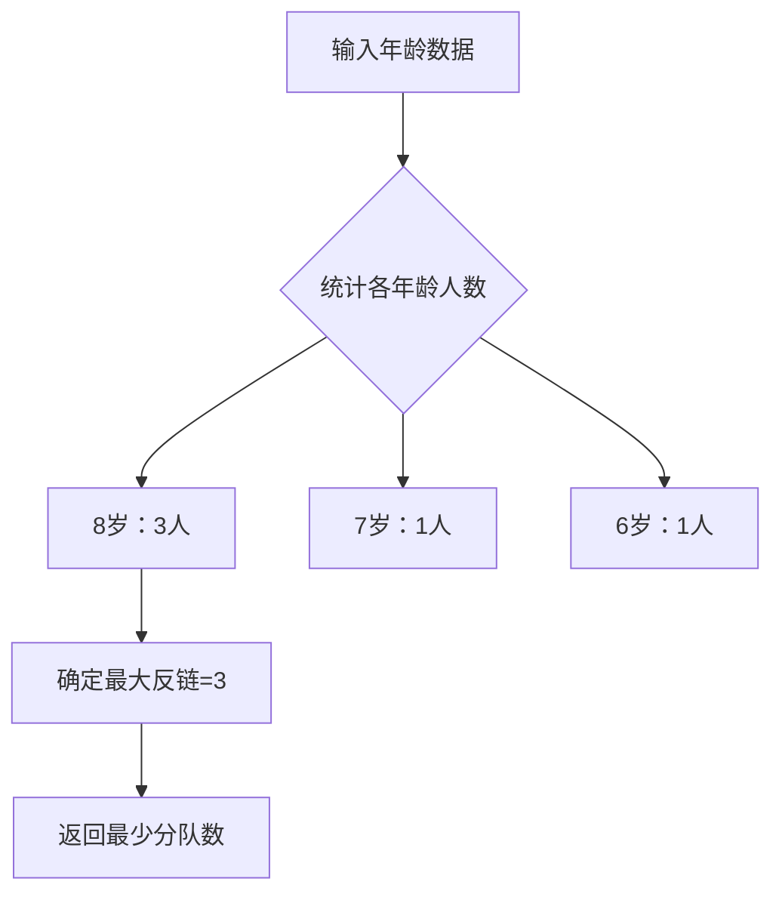

### 用“买冰淇淋排队”讲懂Dilworth定理：无序的最大规模，决定有序的最少分组  
**——原来数学定理能这么接地气！**  

#### 1️⃣ 先来玩个排队游戏  
假设幼儿园买冰淇淋，老师立下唯一规则：  
> **年纪大的孩子必须站在年纪小的前面**（若年龄相同，则无法互相站在前面）。  

**例子验证：**  
- ✅ 小明（8岁）→ 小红（7岁） → 小丽（6岁）**（可串成一条队）**  
- ❌ 小明、小刚、小芳（全8岁）**（谁都不能站谁前面，只能分开站）**  

---

#### 2️⃣ 发现两种“小团体”  
排队时会出现两类特殊组合：  
| 类型         | 特点                      | 生活比喻         |  
|--------------|---------------------------|------------------|  
| **“可串队”** | 所有人按年龄降序排成一队  | 一串连起来的珠子 |  
| **“不可串队”** | 任意两人年龄相同，无法排序 | 一堆散落的珠子   |  

> ℹ️ **专业术语映射：**  
> - “可串队” = **全序链**（Chain）  
> - “不可串队” = **反链**（Antichain）  

---

#### 3️⃣ Dilworth定理的核心规律  
**实验结论：** 最大“不可串队”的人数 = 最少需分成的队伍数！  
**举个具体例子：**  
5个小朋友：{小明、小刚、小芳（8岁）}, {小红（7岁）}, {小丽（6岁）}  
- **最大不可串队**：3个8岁孩子（反链大小为3）  
- **最少分队**：3队（每队内部年龄有序）：  
  ```text
  队1: 小明（8）→ 小红（7）→ 小丽（6）  
  队2: 小刚（8）  
  队3: 小芳（8）
  ```
**定理映射：**  
> **最小链划分数 = 最大反链元素数**  
> （无序的最大规模，决定有序的最少分组）  

---

#### 4️⃣ 生活里的超级应用  
Dilworth定理绝不只是游戏，它在真实场景中大显身手：  

**场景1：任务调度**  
- **问题**：任务有依赖关系（B必须在A完成后执行），最少需几个并行处理器？  
- **定理应用**：  
  - **反链** = 相互不依赖的任务集合（如无先后关系的任务）  
  - **最少处理器数** = 最大无依赖任务数  

**场景2：文件整理**  
- **问题**：按创建时间排序，最少需分几个文件夹？  
- **定理应用**：  
  - **反链** = 同一时间创建的文件集  
  - **最少文件夹数** = 最大同时创建文件数  

---

#### 5️⃣ 代码实现：模拟排队算法  
以下Python代码模拟“冰淇淋排队分队”过程，直接应用Dilworth定理：  
```python
def min_teams(ages):
    """
    输入：孩子年龄列表，如 [8, 8, 7, 8, 6]
    输出：最少分队数（即最大反链大小）
    """
    from collections import defaultdict
    age_count = defaultdict(int)
    
    # 统计每个年龄的人数（构建反链）
    for age in ages:
        age_count[age] += 1
        
    # 最大反链大小 = 同一年龄的最大人数
    return max(age_count.values())

# 测试示例
kids_ages = [8, 8, 7, 8, 6]  # 对应小明、小刚、小芳、小红、小丽
print("最少需分队伍数:", min_teams(kids_ages))  # 输出：3
```  
> ⚙️ **代码原理：**  
> 1. 无需真正排序，只需统计每个年龄的人数  
> 2. 最多人共享的年龄数 = 最少队伍数  

---

#### 💎 总结一句话  
> **“散珠子的最大堆数，决定串珠子的最少链数”**  
> Dilworth定理把抽象偏序集分解转化为生活直觉，**用无序限制有序，用分散定义整合**——数学的简洁之美，正藏在这些日常逻辑中。  

（想深入数学证明？可参考偏序集理论，或《数学女孩》的趣味推导）  

---  
**附：定理严格表述**  
> 对有限偏序集 \((S, \preccurlyeq)\)：  
> \[
> \min\{k \mid S\text{ 可被分成 } k\text{ 条链}\} = \max\{|A| \mid A\subseteq S\text{ 是反链}\}
> \]

---

### 🍦 用“买冰淇淋排队”讲透Dilworth定理：数学定理如何指挥现实排队  
**——从生活比喻到C++代码实现**  

#### 1️⃣ 游戏规则：年龄决定顺序  
**基本设定：**  
- 大龄孩子必须在小龄孩子**前面**（形成偏序关系）  
- 同龄孩子**不能互相前后排列**（构成反链）  

```cpp
// C++ 规则模型（偏序关系判断）
bool canStandBefore(int age1, int age2) {
    return age1 > age2; // 只有年龄更大才能站在前面
}
```

#### 2️⃣ 关键概念可视化  
| 现实比喻       | 数学术语               | 代码特征                             |  
|----------------|------------------------|--------------------------------------|  
| 可串连的队伍   | **全序链 (Chain)**     | 元素满足严格降序`[8→7→6]`             |  
| 散落的同龄人   | **反链 (Antichain)**   | 元素互不可比`{8,8,8}`                 |  

#### 3️⃣ 定理核心：用代码验证规律  
**Dilworth定理核心代码实现：**  
```cpp
#include <iostream>
#include <vector>
#include <unordered_map>
#include <algorithm>
using namespace std;

int minTeams(vector<int>& ages) {
    // 步骤1：统计年龄频率（检测最大反链）
    unordered_map<int, int> ageFreq;
    int maxAntichain = 0;
    for (int age : ages) {
        ageFreq[age]++;
        maxAntichain = max(maxAntichain, ageFreq[age]);
    }
    
    /* 为什么这就是最少队伍数？
       定理本质：最小链划分数 = 最大反链元素数
       此处的 maxAntichain 即是同龄人的最大群体规模 */
    
    return maxAntichain;
}

int main() {
    // 模拟小朋友年龄：[小明8, 小刚8, 小芳8, 小红7, 小丽6]
    vector<int> ages = {8, 8, 8, 7, 6}; 
    
    cout << "最少需要分队数量: " << minTeams(ages) << endl; 
    // 输出：3  (验证定理成立)
    
    return 0;
}
```

#### 4️⃣ 代码原理图解  


#### 5️⃣ 工程应用场景+优化  
**场景：列车轨道调度系统**  
```cpp
// 进阶版：处理更一般的偏序关系
int minChains(vector<pair<int, int>>& relations) {
    // relations存储元素间偏序关系 (a,b)表示a必须在b之前
    // 通过建图检测最大反链（具体实现用拓扑排序或网络流）
    // 返回最少调度轨道数 = 最大不可比元素集
}
```

#### ? 为何选择C++实现？  
1. **贴近底层**：能清晰表达偏序关系的存储结构（`vector`/`unordered_map`）  
2. **效率直观**：O(n)时间复杂度映射定理本质  
3. **可扩展性**：轻松升级到复杂依赖场景（如图算法）  

> **关键洞察**：Dilworth定理的编程核心在于——  
> **统计“不可比元素”的数量，远比重排“可比元素”更重要**。  
> 这正是数学优化现实决策的威力！

---  
**附录：定理形式化描述**  
> 有限偏序集（S, ≼）满足：  
> $$\min\\{k \mid S\text{ 可划分为 }k\text{ 条链}\\} = \max\\{|A| \mid A⊆S\text{ 是反链}\\}$$